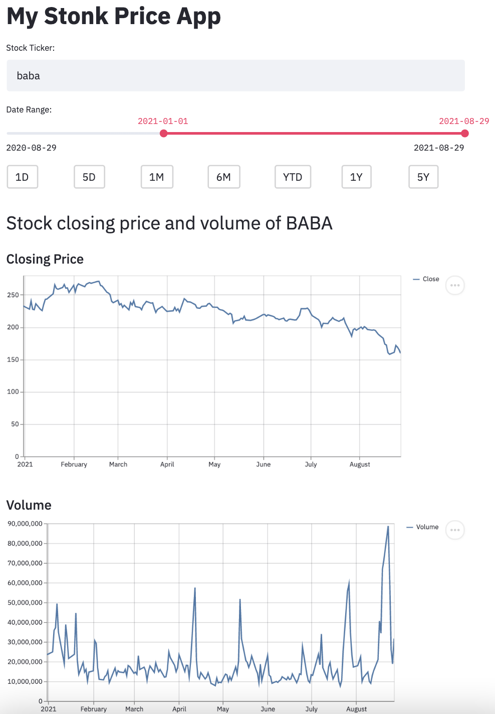

    

# Introduction
A simple stock pricing app that reads data via yahoo API, powered by Streamlit. 

1. Enable user to input stock ticks
2. Invalid stock ticks will reflect simple error message back to user
3. Provide closing price and volume
4. Enable user to adjust time period either through a slider, or through time frame of `1D`, `5D`, `1M`, `6M`, `YTD`, `1Y`, `5Y`
5. User could choose to save charts as .png

# Inspiration
The main aim was to practice using Streamlit, as it's a powerful framework that allows easy web application to be created with python.

# Packages
streamlit, yfinance, numpy, pandas

# Application
App is now deployed and running 24/7 on [heroku](https://chek-stock-app.herokuapp.com/)

Please visit and play around :)

    

# Credits
 - Web scrapping  from [towards data science blog post](https://towardsdatascience.com/how-to-get-stock-data-using-python-c0de1df17e75)

- Youtube @Data Professor